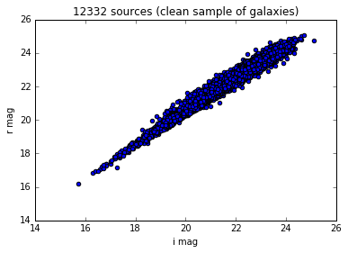
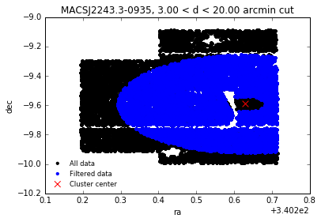

.. note::
    The corresponding Jupyter notebook can be found `here <https://github.com/nicolaschotard/Clusters/blob/master/docs/source/data_tuto.ipynb>`_. You can also reproduce these results in `ipython <https://ipython.org/>`_.

``Astropy`` tables are great to work with, and can be used for all kind of
analysis in the context of our cluster study. You can apply filters,
group by column, concatenate them, etc. For a detailed review on
Astropy tables, see `there <http://docs.astropy.org/en/stable/table/>`_.

Load the table
~~~~~~~~~~~~~~

The ``Astropy`` tables created by the ``clusters_data`` step are saved
in an ``hdf5`` file, and contains two main tables, corresponding to two
output catalogs of the data processing using the DM stack. As an
example, we will use here the ``deepCoadd_forced_src`` catalog, corresponding to the
forced photometry processing (`some details
<https://confluence.lsstcorp.org/display/DM/S15+Multi-Band+Coadd+Processing+Prototype>`_).

If you want to start an analysis with an existing ``hdf5`` file containing catalogs, you can use the one we have created for MACSJ2243.3-0935, which is saved at CC-IN2P3 under::

  /sps/lsst/data/clusters/MACSJ2243.3-0935/analysis/output_v1/MACSJ2243.3-0935_data.hdf5

To load the ``deepCoadd_forced_src`` catalog, do:

.. code:: python

    from Clusters import data
    f = "/sps/lsst/data/clusters/MACSJ2243.3-0935/analysis/output_v1/MACSJ2243.3-0935_data.hdf5"
    d = data.read_data(f)
    fc = d['deepCoadd_forced_src']

``d`` is a dictionnary containing the 'deepCoadd_forced_src', the 'deepCoadd_meas' catalogs and the 'wcs' object. 

.. code:: python

    print d.keys()

.. parsed-literal::

    ['deepCoadd_forced_src', 'wcs', 'deepCoadd_meas']

and ``fc`` is an astropy table

.. code:: python

    print fc

.. parsed-literal::

    base_CircularApertureFlux_3_0_flag_sincCoeffsTruncated ... coord_dec_deg 
                                                           ...      deg      
    ------------------------------------------------------ ... --------------
                                                     False ... -9.50417299504
                                                      True ... -9.50631091083
                                                      True ... -9.50631273401
                                                      True ... -9.50632589495
                                                      True ...  -9.5063327395
                                                     False ...  -9.5062460577
                                                      True ... -9.50629874096
                                                      True ... -9.50635437897
                                                     False ... -9.50600120865
                                                     False ... -9.50549567214
                                                       ... ...            ...
                                                     False ... -9.73333093082
                                                     False ... -9.73388006895
                                                     False ...  -9.7302761071
                                                     False ... -9.73010079525
                                                     False ... -9.72701283749
                                                     False ...  -9.7273114286
                                                     False ... -9.91085559972
                                                     False ... -9.91084514606
                                                     False ...  -9.8851539436
                                                     False ... -9.88578472829
    Length = 1050500 rows

As you can see, there are 

.. code:: python

    N = len(fc)
    print N, "rows"

.. parsed-literal::

    1050500 rows

in this table. This number correspond to the number of sources (ns) times the number of filters (nf): N = ns x nf. In this table, we have the following number of filter:

.. code:: python

    filters = set(fc['filter'])
    nf = len(filters)
    print nf, "filters:", filters 

.. parsed-literal::

    5 filters: set(['i', 'r', 'u', 'z', 'g'])

The number of sources in this catalog if thus:

.. code:: python

    ns = N / nf
    print ns, "sources"

.. parsed-literal::

    210100 sources

The number of columns corresponding to the number of keys available in the catalog is:

.. code:: python

    print "%i columns" % len(fc.keys())
    for k in sorted(fc.keys())[:10]:
        print k

.. parsed-literal::

    207 columns
    base_CircularApertureFlux_12_0_flag
    base_CircularApertureFlux_12_0_flag_apertureTruncated
    base_CircularApertureFlux_12_0_flux
    base_CircularApertureFlux_12_0_fluxSigma
    base_CircularApertureFlux_12_0_mag
    base_CircularApertureFlux_12_0_magSigma
    base_CircularApertureFlux_17_0_flag
    base_CircularApertureFlux_17_0_flag_apertureTruncated
    base_CircularApertureFlux_17_0_flux
    base_CircularApertureFlux_17_0_fluxSigma

Apply filters
~~~~~~~~~~~~~

You can filter this table to, for example, only keep the ``i`` and ``r`` magnitude of the ``modelfit_CModel_mag`` for all sources:

.. code:: python

    magi = fc['modelfit_CModel_mag'][fc['filter'] == 'i']
    magr = fc['modelfit_CModel_mag'][fc['filter'] == 'r']

and plot them against each other

.. code:: python

    # ignore the following line
    %matplotlib inline

.. code:: python

    import pylab
    pylab.scatter(magi, magr)
    pylab.xlabel('i mag')
    pylab.ylabel('r mag')
    pylab.title('%i sources (galaxies+stars)' % len(magi))

.. parsed-literal::

    <matplotlib.text.Text at 0x7f304d91ad10>

.. image:: data_tuto_files/data_tuto_18_1.png

A few standard filters have been implemented in ``data`` and can be used directly to get a clean sample of galaxies:  

.. code:: python

    # ignore the following line
    import warnings; warnings.filterwarnings("ignore")

.. code:: python

    data_filtered = data.filter_table(d)
    fc_filtered = data_filtered['deepCoadd_forced_src']

The same plot as in the above example now looks like

.. code:: python

    magi_filtered = fc_filtered['modelfit_CModel_mag'][fc_filtered['filter'] == 'i']
    magr_filtered = fc_filtered['modelfit_CModel_mag'][fc_filtered['filter'] == 'r']
    pylab.scatter(magi_filtered, magr_filtered)
    pylab.xlabel('i mag')
    pylab.ylabel('r mag')
    pylab.title('%i sources (clean sample of galaxies)' % len(magi_filtered))

.. parsed-literal::

    <matplotlib.text.Text at 0x7f319f02ce10>

See `the code <https://github.com/nicolaschotard/Clusters/blob/master/clusters/data.py#L207>`_ for a few other examples on how to use filters.

Add a new column
~~~~~~~~~~~~~~~~

You can also add a new column to the table (`examples here <https://github.com/nicolaschotard/Clusters/blob/master/clusters/data.py#L53>`_)

.. code:: python

    from astropy.table import Column

Create a simple shifted magnitude array

.. code:: python

    shifted_mags = fc_filtered['modelfit_CModel_mag'] + 2

Add it to the initial table and plot it against the initial magnitude (for the `i` filter here)

.. code:: python

    fc_filtered.add_column(Column(name='shifted_mag', data=shifted_mags,
                                  description='Shifted magnitude', unit='mag'))

.. code:: python

    magi_filtered = fc_filtered['modelfit_CModel_mag'][fc_filtered['filter'] == 'i']
    magi_shifted =  fc_filtered['shifted_mag'][fc_filtered['filter'] == 'i']
    pylab.scatter(magi_filtered, magi_filtered)
    pylab.scatter(magi_filtered, magi_shifted, c='r')
    pylab.xlabel('i mag')
    pylab.ylabel('shifted i mag')
    pylab.title('%i sources (clean sample of galaxies)' % len(magi_filtered))

.. parsed-literal::

    <matplotlib.text.Text at 0x7f3159784290>

.. image:: data_tuto_files/data_tuto_30_1.png

You can also add several columns using ``fc.add_columns([Columns(...), Columns(...), etc])``.

Filter around the cluter center
~~~~~~~~~~~~~~~~~~~~~~~~~~~~~~~

If you only want to work on a sample of galaxies center around the cluster at a certain radius, do:

.. code:: python

    config = data.load_config('/sps/lsst/data/clusters/MACSJ2243.3-0935/analysis/output_v1/MACSJ2243.3-0935.yaml') 
    fc_filtered_2 = data.filter_around(fc_filtered, config, exclude_outer=25, exclude_inner=3, plot=True, unit='arcmin')

The output of ``filter_around`` is a filtered data table.
