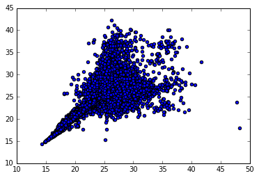

Asptroy tables are great to work with, and can be used for all kind of
analysis in the context of our cluster study. You can apply filters,
group by column, concatenate them, etc. For a detailed review on
Astropy tables, see `there <http://docs.astropy.org/en/stable/table/>`_.

Load the table
~~~~~~~~~~~~~~

The ``Astropy`` tables created by the ``clusters_data`` step are saved
in an ``hdf5`` file, and contains two tables, corresponding to two
output catalogs of the data processing using the DM stack. As an
example, we will use here the ``forced`` catalog, corresponding to the
forced photometry processing (`some details
<https://confluence.lsstcorp.org/display/DM/S15+Multi-Band+Coadd+Processing+Prototype>`_).

If you want to start an analysis with an existing ``hdf5`` file containing catalgs, you can use the one we have created for MACSJ2243.3-0935, which is saved at CC-IN2P3 under::

  /sps/lsst/data/clusters/MACSJ2243.3-0935/analysis/output_v1/MACSJ2243.3-0935_data.hdf5

To load the ``forced`` catalog, do:

.. code:: python

    from Clusters import data
    f = "/sps/lsst/data/clusters/MACSJ2243.3-0935/analysis/output_v1/MACSJ2243.3-0935_data.hdf5"
    d = data.read_data(f)
    fc = d['forced']

``d`` is a dictionnary containing the 'forced' and 'meas' catalogs

.. code:: python

    print d.keys()

.. parsed-literal::

    ['forced', 'meas']

and ``fc`` is an astropy table

.. code:: python

    print fc

.. parsed-literal::

    base_CircularApertureFlux_70_0_flux ... coord_dec_deg 
                     ct                 ...      deg      
    ----------------------------------- ... --------------
                                    nan ... -9.50417299504
                                    nan ... -9.50631091083
                                    nan ... -9.50631273401
                                    nan ... -9.50632589495
                                    nan ...  -9.5063327395
                                    nan ...  -9.5062460577
                                    nan ... -9.50629874096
                                    nan ... -9.50635437897
                                    nan ... -9.50600120865
                                    nan ... -9.50549567214
                                    ... ...            ...
                          1.50556364615 ... -9.73333093082
                          3.38628042737 ... -9.73388006895
                          34.7225751682 ...  -9.7302761071
                          34.9437715002 ... -9.73010079525
                          33.6814404931 ... -9.72701283749
                          30.9058971442 ...  -9.7273114286
                         -57.1279619848 ... -9.91085559972
                          -8.0121195399 ... -9.91084514606
                         -7.38991968287 ...  -9.8851539436
                         -20.8298629206 ... -9.88578472829
    Length = 1050500 rows

As you can see, there are 

.. code:: python

    N = len(fc)
    print N, "rows"

.. parsed-literal::

    1050500 rows

in this table. This number correspond to the number of sources (ns) times the number of filters (nf): N = ns x nf. In this table, we have the following number of filter:

.. code:: python

    nf = len(fc.group_by('objectId').groups[0])
    print nf, "filters"

.. parsed-literal::

    5 filters

The number of sources in this catalogs if thus:

.. code:: python

    ns = N / nf
    print ns, "sources"

.. parsed-literal::

    210100 sources

The number of columns corresponding to the number of keys available in the catalogs is:

.. code:: python

    print "%i columns" % len(fc.keys())
    for k in sorted(fc.keys())[:10]:
        print k

.. parsed-literal::

    195 columns
    base_CircularApertureFlux_12_0_flag
    base_CircularApertureFlux_12_0_flag_apertureTruncated
    base_CircularApertureFlux_12_0_flux
    base_CircularApertureFlux_12_0_fluxSigma
    base_CircularApertureFlux_12_0_mag
    base_CircularApertureFlux_12_0_magSigma
    base_CircularApertureFlux_17_0_flag
    base_CircularApertureFlux_17_0_flag_apertureTruncated
    base_CircularApertureFlux_17_0_flux
    base_CircularApertureFlux_17_0_fluxSigma

Apply filters
~~~~~~~~~~~~~

You can filter this table to, for example, only keep the ``i`` and ``r`` magnitude of the ``base_CircularApertureFlux_12_0_mag`` for all sources:

.. code:: python

    magi = fc['base_CircularApertureFlux_12_0_mag'][fc['filter'] == 'i']
    magr = fc['base_CircularApertureFlux_12_0_mag'][fc['filter'] == 'r']

.. code:: python

    %matplotlib inline
    import pylab
    pylab.scatter(magi, magr)

.. parsed-literal::

    <matplotlib.collections.PathCollection at 0x7fe0f75886d0>

or with an other flux measurement

.. code:: python

    magi = fc['modelfit_CModel_mag'][fc['filter'] == 'i']
    magr = fc['modelfit_CModel_mag'][fc['filter'] == 'r']
    pylab.scatter(magi, magr)

.. parsed-literal::

    <matplotlib.collections.PathCollection at 0x7fdfeafe5f10>

.. image:: data_tuto_files/data_tuto_18_1.png

Add a new column
~~~~~~~~~~~~~~~~

If you want to add a new column to the table

